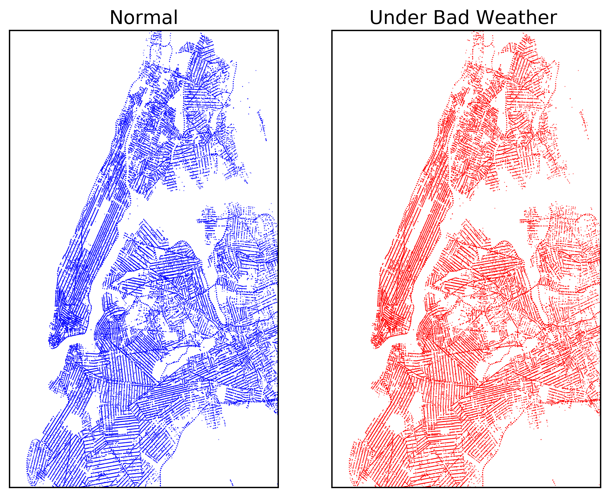

# NYC-Collision-Data-Analysis
##Analyze NYC Collision Data under Different Weather Conditions

Climate change and global warming have been important topics of the problems we are facing these years.  One consequence of the recent climate change and global warming is the increase of extreme weather conditions.   Understanding the effects of bad weather conditions can help us prevent or reduce their negative influences. More importantly, this encourage people admire our nature and better protect our environment.  

## Data Sources
 - The collision data is from NYC OpenData (https://nycopendata.socrata.com/).The data set chosen here is **NYPD Motor Vehicle Collisions**, where cotains details of motor vehicle collisions in New York City provided by the Police Department (NYPD) for the last four years.
 - The weather data is from weather underground website (https://www.wunderground.com), through API access. 
  
## Prelimitary Result

The first step is to visualize the collision location distribution across the city, as shown in plot 1. This plot compares distribution on normal weather conditions and bad weather conditions. Here, bad weather conditions including rain, snow, fog, fog-rain, rain-snow, fog-rain-snow and fog-snow. Other weather conditions are considered normal. We can see that under both conditions, collision locations are basically evenly distributed across the city, but with more happened in the southern part of Manhattan.  The reason might be that the traffic volume is higher at the central business area, but other factors may also count, such as the traffic regulation, which requires further consideration.

In the second part, I compared the contributing factors of the collisions under normal and bad weather conditions. The result is shown in plot 2. The vertical axis shows a list of contributing factors, and the horizontal axis shows the corresponding fraction.  It is clear that under bad weather conditions, the fraction from ‘Driver Inattention/Distraction’ is actually reduced by 8% compare to normal weather conditions, suprisingly.  Factors contribute more to collisions under bad weather including ‘Pavement Slippery’, ‘Prescription Medication’, and ‘Physically Disability’. The ‘Pavement Slippery’ part is understandable, but the latter two are not obvious which need further investigation.

The last piece of analysis shows the effect of bad weather conditions on collisions per day. The result is shown in plot 3, where the histograms are normalized. We can see that under normal weather condition, the distribution is a little left skewed, with a mode around 600 collisions per day. But under bad weather conditions, the distribution develops a clear tail towards the higher number of collisions per day. This is an evidence of the negative influence of the bad weather conditions. 

